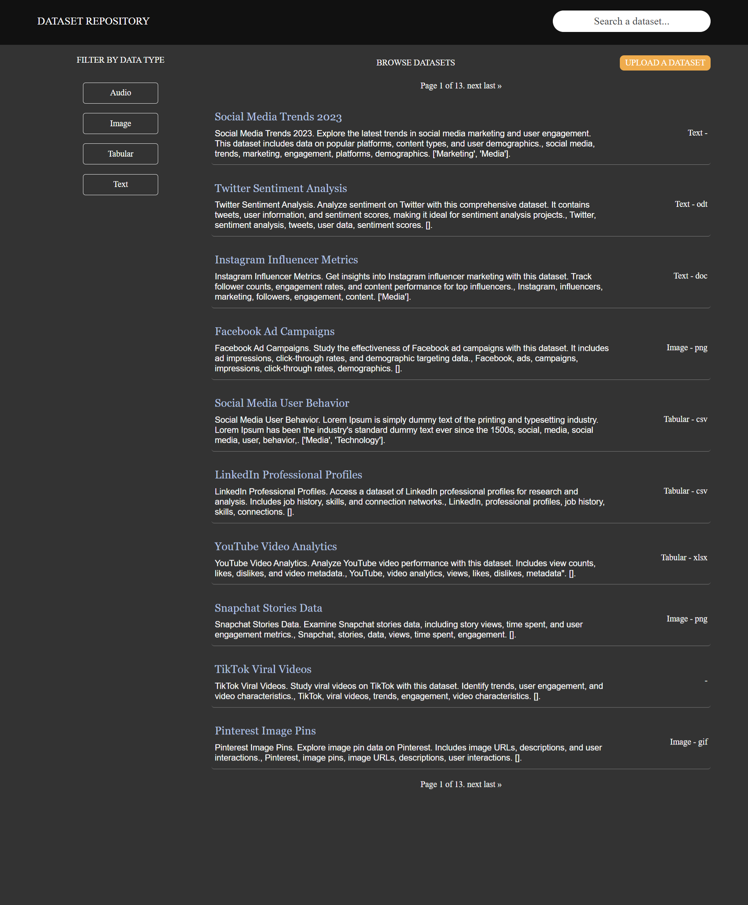
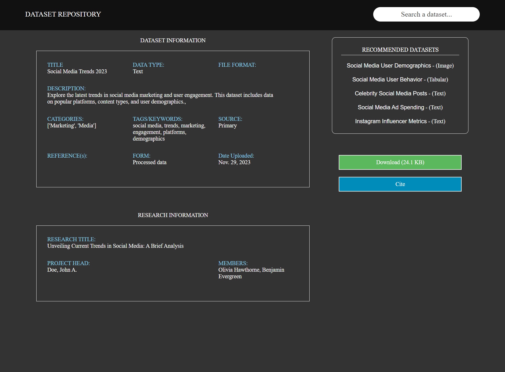

# Dataset Recommender System Prototype

## Table of Contents

- [Project Description](#project-description)
- [Features](#features)
- [Screenshots](#screenshots)
- [Tech Stack](#tech-stack)

## Project Description

This is a prototype **Dataset Recommender System** developed using the Django framework for the backend, and vanilla HTML, CSS, and JavaScript for the frontend. The system recommends datasets based on current datasets' text content files.

## Features

- Dataset browsing and recommendation engine.
- Search functionality for datasets.
- Dynamic content rendering using JavaScript and backend integration through Django.
- Simple, clean UI using custom HTML and CSS.

## Screenshots

## Tech Stack

- **Backend**: Django (Python)
- **Frontend**: HTML, CSS, JavaScript
- **Database**: SQLite (for local development)
